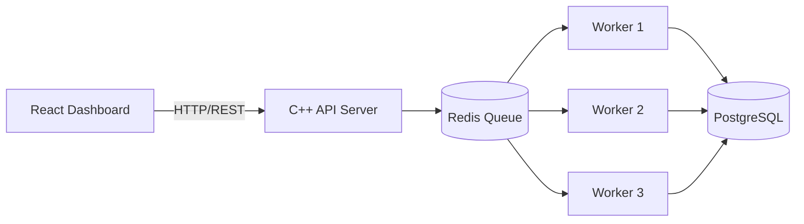

# Distributed Job Queue

A distribution job queue and task processing system built in modern C++.

Clients submit computational jobs through a REST API. Jobs land in a Redis-backed queue, where independent C++ worker processes consume and execute them while PostgreSQL persists job state and metadata. The project is built deliberately, step by step, with each architectural decision documented as it is made.

## Status

| Phase | Focus | Status |
| --- | --- | --- |
| Phase 0 | Foundation: environment, repository, toolchain | Complete |
| Phase 1 | C++ HTTP API server | In progress |
| Phase 2-14 | Job model, Redis queue, workers, persistence, fault tolerance, React dashboard, Docker | Planned |

## Target Architecture



## Tech Stack

| Layer | Technology |
| --- | --- |
| Backend / worker processes | C++20 (modern C++), CMake, cpp-httplib |
| Queue | Redis |
| Persistence | PostgreSQL |
| Dashboard | React + Vite |
| Packaging | Docker + Docker Compose |
| Version control | Git |

## Repository Layout

```
distributed-job-queue/
├── backend/     C++ REST API server (currently a toolchain probe)
├── worker/      C++ worker processes (planned)
├── frontend/    React dashboard (planned)
├── tests/       Tests (planned)
├── docs/        Per-phase design notes (planned)
├── CMakeLists.txt
└── README.md
```

## Getting Started

Prerequisites (in WSL2 / Ubuntu 24.04):

- g++ 13+
- CMake 3.16+
- make

```bash
cmake -S . -B build
cmake --build build
./build/backend/djq-backend
```

The current backend target is a minimal C++20 program that verifies the toolchain; the HTTP server lands in Phase 1.

## Development Roadmap

1. Foundation
2. C++ HTTP API server
3. Job model
4. Redis queue
5. Worker process
6. Multiple workers + concurrency
7. PostgreSQL persistence
8. Retry + failure handling
9. Priority queues
10. Worker heartbeats + failure detection
11. Reliability
12. Security + rate limiting
13. React dashboard
14. Dockerization
15. Testing + benchmarking + documentation